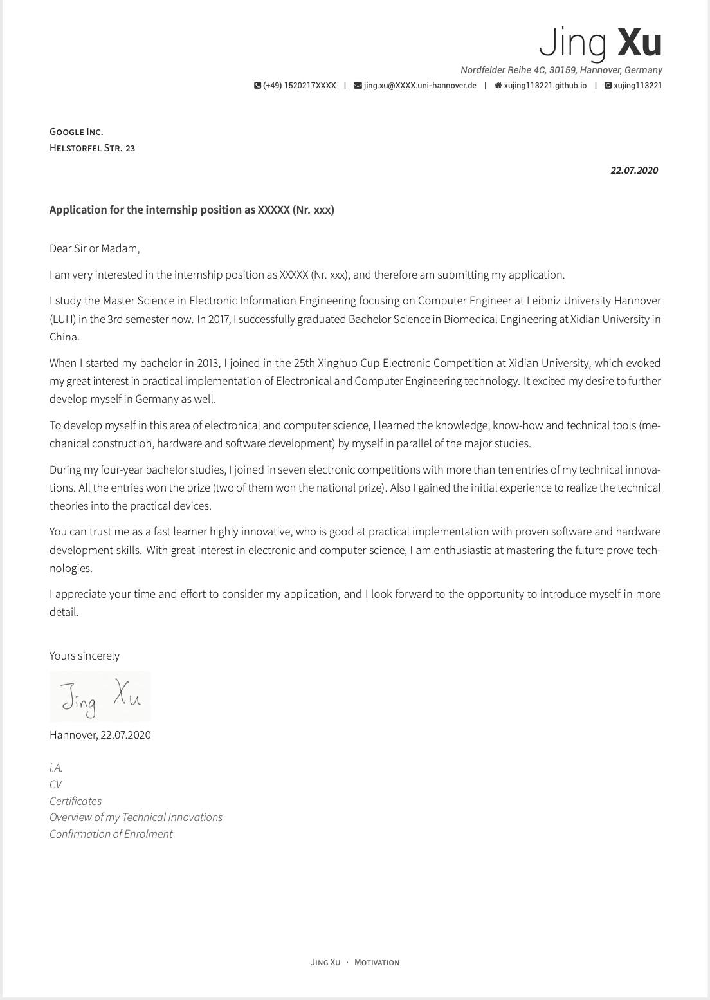

## My resume and cover letter in English and German

I edited my resume and cover letter using the template form  [posquit0/Awesome-CV](https://github.com/posquit0/Awesome-CV). And i fixed some source files to make the template to more fit my status.


### What i did

+ Create a Resume and a cover letter in English.

+ Create a Resume and a cover letter in german.

+ Create Makefile and shell script, the resume and the cover letter can be created automatically and quickly.

### How to use it

#### Methode 1: use Makefile

```bash
make cover_de           # create German coverletter
make resume_de          # create German resume
make cover_resume_de    # create German coverletter and resume

make cover_en           # create English coverletter
make resume_en          # create English resume
make cover_resume_en    # create Englsih coverletter and resume

make all                # create all
make clean              # delete intermediate files 
make depclean           # delete intermediate files and pdf files
```


**Notice**: *Before using make command, please modify your information in the Latex files!*

#### Method 2: use shell script

```bash make.sh
$ ./make.sh
```
Enter the above command in `Terminal` ,then enter your information as prompted. For example:
```
=== Please choice language: 
	1.English	2.German	3.Both
1
=== Please tell me the name of you applicated Job:
System development for antenna measurement systems

=== Please tell me the information of your applicated Company:
Recipient: 
Company: Rohde & Schwarz GmbH & Co. KG
Address: München
Postcode, location: 

=== Please Choose the following options to tell me the Recipient:
	1. Dear Sir or Madam,
	2. Dear Mr. Family Name,
	3. Dear Ms. Family Name,
Input your choice nummber: 2
Tell me the name: Jing Xu

=== Please check your inputs!
If wrong, input 1. If right, input any key: 
    ....
```

Because i writed this file `make.sh` in Max OS, so maybe it doesn't work in Windows. 

### Example

#### Resume


#### Cover letter

